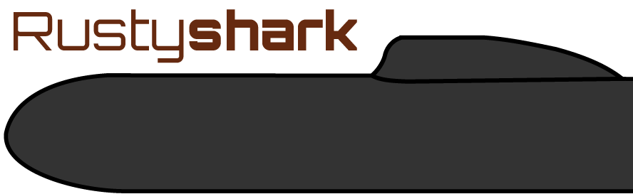

`rshark`, the Rusty Shark library, is a library for deep inspection
of malicious packets.

[Wireshark](https://www.wireshark.org) is a very useful tool for network
debugging, but it's had its
[fair share of security vulnerabilities](https://www.wireshark.org/security).
`rshark` uses the type safety of Rust to enable the dissection of
malicious packets without worry of buffer overflows or other common memory errors.
That is, Rusty Shark is compartmentalized to minimize the damage that
can be done by a successful adversary. The submarine metaphors write themselves.

Further details are available
[in the Rustdoc](http://musec.github.io/rusty-shark/rshark/).
